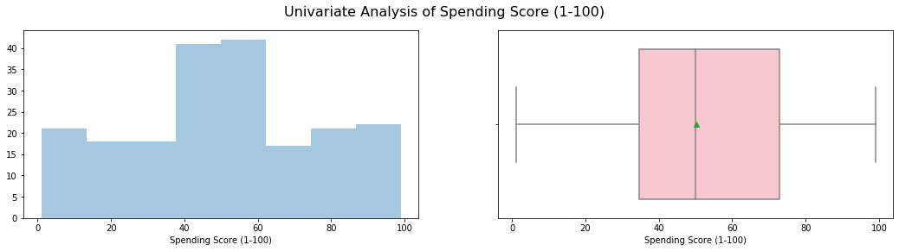
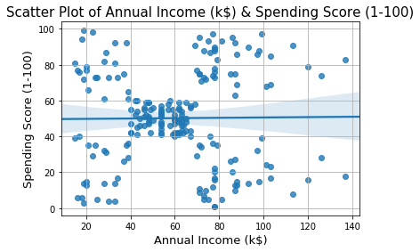
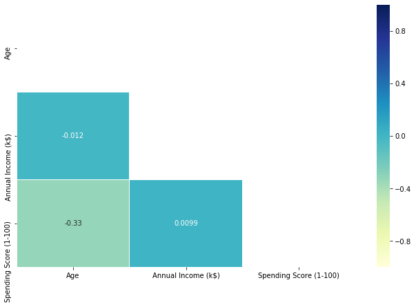
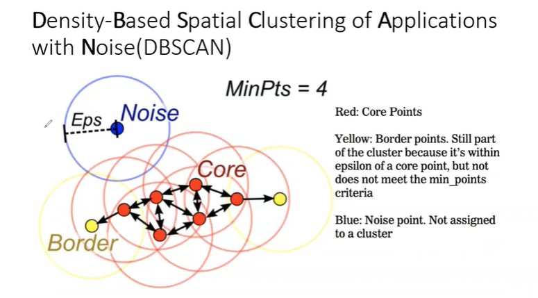
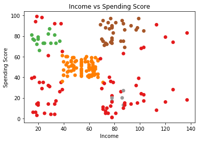
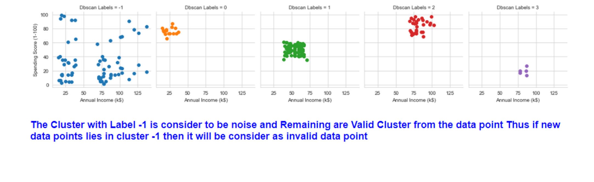

## Data Analysis and Visualisation using DBSCAN-Clustering

In this project I'm trying to analyze and visualize the data and form Clusters. I have 3 input feature i.e Age, Annual Income and Spending Score. DBSCAN works well if there are outlier in dataset Thus it will exclude the outlier and cluster will be formed. Seperate Cluster of outlier i.e Noise is formed which will be labelled as -1.

## Data Description

    Age - Age of User visiting shop.
    
    Annual Income - It will be in dollar the yearly income of User
    
    Spending Score - Value lies between 1 to 100. 1 being the lowest and 100 being the highest
    
## Process

   1)Read the data set
    
   2)EDA
    
   3)check multicollinearity between input feature
    
   4)Build the Model
    
   5)Visualize the Cluster
    
   6)Find no of data point in each cluster
   
## Softwares and Libraries Used:

    - Anaconda Distribution
	  - Jupyter Notebook
	
	  - Numpy
	  - Pandas
	  - Matplotlib
	  - Seaborn
    - Sklearn 
    - warnings 
    
## Importing the Modules:

    import pandas as pd
    import os as os
    import numpy as np

    #Visuals    
    import matplotlib.pyplot as plt
    import seaborn as sns

    #Pre-processing
    from sklearn.preprocessing import StandardScaler

    #model
    from sklearn.cluster import DBSCAN

    import warnings
    warnings.filterwarnings("ignore")
  
## Analysis:

1)Univariant Analysis

2)Bivariant Analysis

3)Correlation Using HeatMap

4)DBSCAN Clustering Analysis:

5)Cluster visualize:

6)Cluster Analysis:

## Conclusing Statement

  Thus In DBSCAN we can filter out the noise, But in our case it is Not suitable as data points are not densier, So DBSCAN label (-1) is consider to be noise and other 4 are     
  Clusers

## Note

  You can also view the code in HTML format

